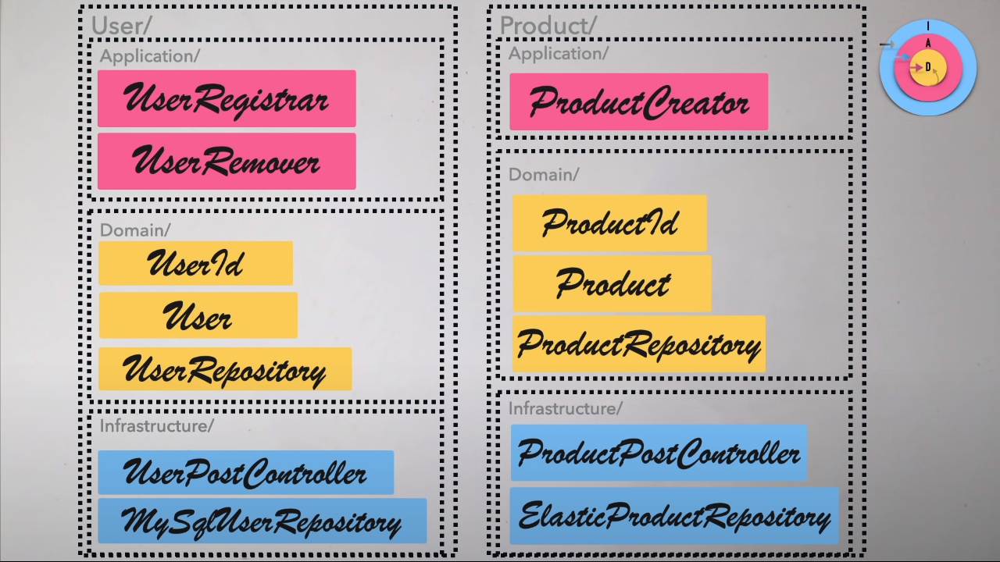
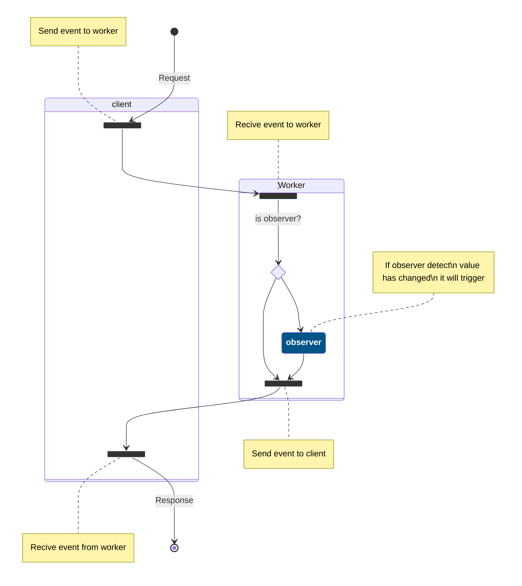

# Tiny WebWorker Event Driven Architecture

La idea de este proyecto es crear un proyecto base donde se use una arquitectura basada en eventos para usarlo con WebWorker

## Opinión

Esta estructura de carpetas es una forma opinionada de como creo yo @RubenPX de cual es la forma que mejor me parece a la hora de estructurar las carpetas y el estilo de código.

## ¿Porque pensar como una libreria a parte y no como una aplicación única?

En realidad, la presentación (Frontend) es una aplicación que ejecuta la libreria, asi que en este caso, es facil ejecutar los metodos que nos interesa.

Para que sea fácil para otros desarrolladores, he deccidido usar el patron Factory para construir las request. Esto tiene varias ventajas al respecto, siendo la mas importante que el desarrollador no tenga que preocuparse de como tiene hablar entre el navegador y el webworker. Ya esta todo hecho y con controles de errores en caso de que se descuide accidentalmente de controlar excepciones.

## Estructura de proyecto

El proyecto esta dividido en 2 partes.

- `Frontend`: Presentación para el usuario usando cualquier tipo de framework. (En este ejemplo uso SvelteJS)
- `App`: Carpeta donde se estructura la funcionalidad. Casos de uso, objetos, repositorios, etc... Es este caso se opta por usar Clean Architecture + Vertical Slicing. Todo siguiendo la opinión de [CodelyTV](https://www.youtube.com/watch?v=y3MWfPDmVqo) y [About Clean Code](https://www.youtube.com/watch?v=7ZXW_oWdTk4).

> Aqui esta un concepto de como se reparte el codigo y sus carpetas. En este caso, la proposición es "Que capa eres y que eres"
> 

## Funcionamiento de la aplicación

El objetivo de este repositorio es unicamente dejar en un hilo a parte el procesamiento de datos. Para ello se "simula un servidor" en forma de WebWorker.

Aqui debajo, se define como se comunica el cliente (Navegador) con el Hilo a parte ([WebWorker](https://developer.mozilla.org/es/docs/Web/API/Web_Workers_API/Using_web_workers)).

> [!note]
> Descripción aun por terminar (Probablemente se hara en inglés)
