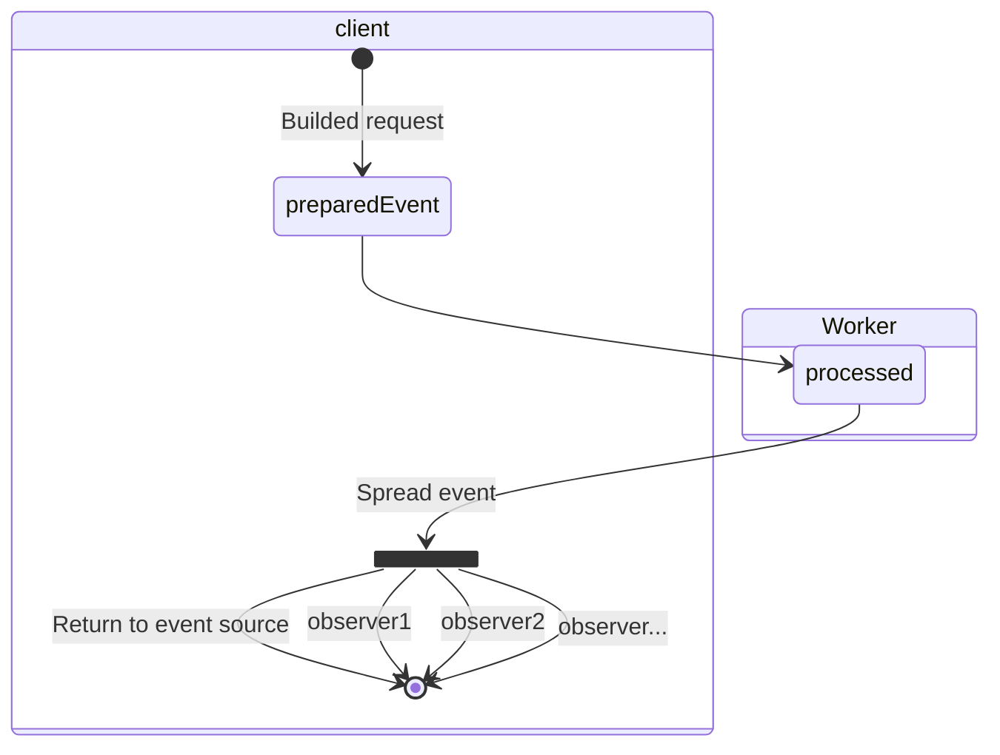

# Tiny WebWorker Event Driven Architecture

La idea de este proyecto es crear un proyecto base donde se use una arquitectura basada en eventos para usarlo con WebWorker

## Opinión

Esta estructura de carpetas es una forma opinionada de como creo yo @RubenPX de cuál es la forma que mejor me parece a la hora de estructurar las carpetas y el estilo de código.

## ¿Porque pensar como una libreria a parte y no como una aplicación única?

En realidad, la presentación (Frontend) es una aplicación que ejecuta la librería, así que en este caso, es facil ejecutar los métodos que nos interesa.

Para que sea fácil para otros desarrolladores, he decidido usar el patrón de código Factory para construir las request. Esto tiene varias ventajas al respecto, siendo la más importante que el desarrollador no tenga que preocuparse de cómo tiene hablar entre el navegador y el webworker. Toda la libreria esta realizada de modo se puedan recibir eventos (tanto de resultados como de errores)

## Estructura de proyecto

El proyecto está dividido en 2 partes.

- `Frontend`: Presentación para el usuario usando cualquier tipo de framework. (En este ejemplo uso SvelteJS)
- `App`: Carpeta donde se estructura la funcionalidad. Casos de uso, objetos, repositorios, etc... Es este caso se opta por usar Clean Architecture + Vertical Slicing. Todo siguiendo la opinión de [CodelyTV](https://www.youtube.com/watch?v=y3MWfPDmVqo) y [About Clean Code](https://www.youtube.com/watch?v=7ZXW_oWdTk4).

> Aquí está un concepto de cómo se reparte el código y sus carpetas.   
> En este caso, la proposición es `Que eres y que capa eres`
> 

## Funcionamiento de la aplicación

El objetivo de este repositorio es unicamente dejar en un hilo a parte el procesamiento de datos. Para ello se simula un "servidor" en forma de WebWorker.

Aquá debajo, se define como se comunica el cliente (Navegador) con el Hilo a parte ([WebWorker](https://developer.mozilla.org/es/docs/Web/API/Web_Workers_API/Using_web_workers)).

## Roadmap

- [X] Enviar y recibir eventos entre el worker y el browser
- [X] Permitir la observación de eventos
- [X] Controlar los errores de la aplicación
- [X] logs mejorados en consola (Para ver los eventos, requiere que tengas verbose activado)
