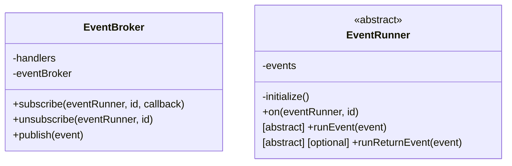
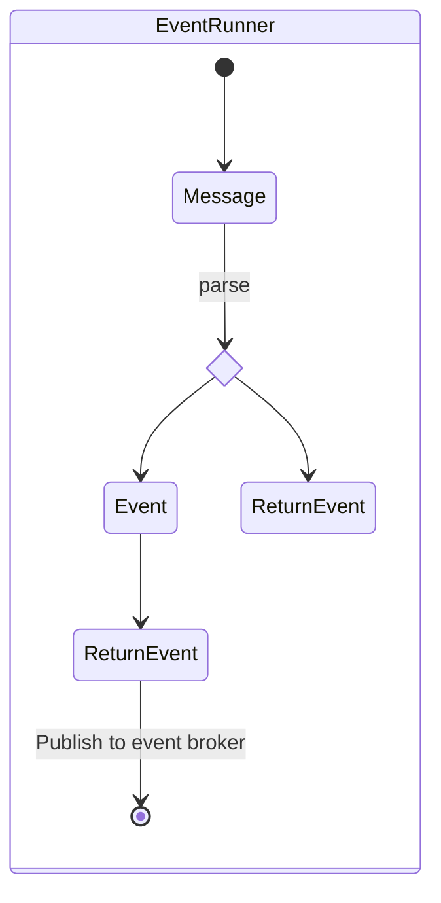

# Tiny WebWorker Event Driven Architecture

La idea de este proyecto es crear un proyecto base donde se use una arquitectura basada en eventos para usarlo con WebWorker

## Diagrama de Event Broker

## Fases de un evento

> [!note]
> Descripción aun por terminar (Probablemente se hara en inglés)
